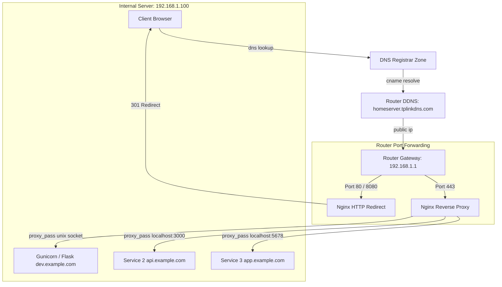

# Server and Network Configuration Guide

This guide explains how to configure the server network environment, router settings, domain mapping, and Nginx reverse proxy. It incorporates comprehensive Nginx operational procedures, zero-downtime reloads, symlink configuration, Certbot SSL automation, and troubleshooting.

> [!IMPORTANT]
> This guide uses placeholder example values. Your specific server configuration (actual IPs, ports, domains, and subdomains) must only be defined in your local, git-ignored [setup.conf](./setup.conf).

## Example Configuration Values
The examples throughout this guide assume the following network layout:
- **Example Domain**: `example.com`
- **Example DDNS Hostname**: `homeserver.tplinkdns.com` (managed by router)
- **Example Local Server IP**: `192.168.1.100` (internal host IP)
- **Example Router Gateway IP**: `192.168.1.1`
- **Example Ports**:
  - HTTP Redirect Port: `8080` (used if standard port 80 is blocked by ISP)
  - HTTP standard Port: `80`
  - HTTPS secure Port: `443`
- **Example Subdomains**: `dev.example.com`, `api.example.com`, `app.example.com`

---

## 0. Overview: Request Flow Direction

The diagram below maps how a request traverses the internet from a client's browser, through DNS and the home router, to the individual services running on your server (`192.168.1.100`).



For specific system and application configurations, refer to:
- [setup.conf](./setup.conf) - Local configuration variables.
- [BackendSetUp.md](./BackendSetUp.md) - Gunicorn and Flask application deployment.

---

## 1. Dynamic DNS (DDNS)

A Dynamic DNS hostname automatically points to your home network's public IP address, which your ISP dynamically changes.

### Option A (Recommended): Router-Level DDNS (TP-Link Deco / Other)
DDNS is best configured directly within the router hardware via its administrative interface or app. This is more stable than terminal-based scripts because the hardware instantly detects WAN changes.

If using a TP-Link Deco system:
1. Open the **Deco App** on your mobile device.
2. Navigate to **More** (bottom right menu) -> **Advanced** -> **DDNS**.
3. Toggle DDNS **ON**.
4. Register your domain prefix (e.g., `homeserver`) to bind to `tplinkdns.com`.
5. Your hostname becomes: `homeserver.tplinkdns.com`.

### Option B: Terminal Client (DUC)
If you prefer a terminal-based third-party solution (like No-IP), you can install the Dynamic Update Client (DUC) on your Linux server:

```bash
cd /tmp
wget http://www.no-ip.com/client/linux/noip-duc-linux.tar.gz
tar xf noip-duc-linux.tar.gz
cd noip-2.1.9-1/
sudo make install
```
Configure the DUC with your provider credentials and your registered hostname.

---

## 2. Router Port Forwarding

Port forwarding tells your router which local device should receive traffic hitting specific external ports.

### Configuration Target (Example values)
- **Gateway IP**: `192.168.1.1`
- **Server Local IP**: `192.168.1.100`

### Forwarding Rules Table
Open your router's administrative page or app, navigate to **Port Forwarding** / **Virtual Servers**, and add the following rules pointing to your server's local IP:

| Rule Name | External Port | Internal Port | Protocol | Device IP | Description |
| :--- | :--- | :--- | :--- | :--- | :--- |
| **HTTP** | `80` | `80` | TCP | `192.168.1.100` | Required for standard HTTP redirects and ACME SSL validation challenges. |
| **HTTPS** | `443` | `443` | TCP | `192.168.1.100` | Primary entry point for all secure web traffic. |
| **HTTP_REDIRECT** | `8080` | `8080` | TCP | `192.168.1.100` | Custom port used for HTTP-to-HTTPS redirect if standard port 80 is blocked by your ISP. |

> [!NOTE]
> Many residential internet service providers (ISPs) block incoming traffic on standard port 80. If your ISP blocks port 80, you can configure a custom redirect port (e.g., `8080`). Alternatively, if you always connect directly via HTTPS (`https://`), you can omit the HTTP/HTTP_REDIRECT forwarding rules entirely since HTTPS (443) traffic will still route correctly.

---

## 3. DNS Configuration (Registrar)

You must configure DNS records to route your custom domain and subdomains to your home router. Because the public IP is dynamic, you route subdomains to your DDNS hostname using **CNAME** records.

### How to configure CNAMEs (e.g., Hostinger / GoDaddy):
1. Log in to your **DNS Registrar's Control Panel**.
2. Navigate to your domain's **DNS Zone Editor**.
3. Create the following records:

| Type | Name (Host/Subdomain) | Points to (Value) | TTL |
| :--- | :--- | :--- | :--- |
| `CNAME` | `dev` | `homeserver.tplinkdns.com` | Default |
| `CNAME` | `api` | `homeserver.tplinkdns.com` | Default |
| `CNAME` | `app` | `homeserver.tplinkdns.com` | Default |

---

## 4. Nginx Server Configuration & Operational Management

Nginx receives incoming HTTP/HTTPS traffic on the server, matches the domain header, and proxies the request to the right service.

### 4.1. Installation
Install Nginx and verify it starts:
```bash
sudo apt update
sudo apt install nginx -y
sudo systemctl start nginx
```

### 4.2. Core Operations & Commands

#### 1. Syntax Verification
Before applying changes, always run a dry run test to prevent crashing active server block routing:
```bash
sudo nginx -t
```

#### 2. Zero-Downtime Reloading
Use reload to apply new configurations without interrupting current active client connections:
```bash
sudo systemctl reload nginx
```

#### 3. Service Inspection
Check if Nginx is active, enabled, and running without errors:
```bash
sudo systemctl status nginx
```

### 4.3. Directory Structure and Symlink Management

Nginx configurations are stored in `sites-available` and symlinked to `sites-enabled` to activate:
- **Available Site Configs**: `/etc/nginx/sites-available/`
- **Active Site Configs**: `/etc/nginx/sites-enabled/`

#### Activating a Site Configuration
To enable a configuration file (e.g., `dev.example.com`):
```bash
sudo ln -sf /etc/nginx/sites-available/dev.example.com /etc/nginx/sites-enabled/
```
Always verify syntax and reload immediately after linking:
```bash
sudo nginx -t && sudo systemctl reload nginx
```

#### Disabling a Site Configuration
To disable a site without deleting the configuration file:
```bash
sudo rm /etc/nginx/sites-enabled/dev.example.com
sudo nginx -t && sudo systemctl reload nginx
```

### 4.4. Deploying Subdomains from Template

To create a new subdomain configuration from the template:
1. Refer to the configuration blueprints in [nginx.conf.template](./nginx.conf.template).
2. Choose the appropriate pattern (Unix socket, Static + API, or Local Port).
3. Copy the configuration block to `/etc/nginx/sites-available/<subdomain>.<domain_name>`, replacing placeholders with values from your local [setup.conf](./setup.conf).
4. Symlink to `sites-enabled/`:
   ```bash
   sudo ln -sf /etc/nginx/sites-available/<subdomain>.<domain_name> /etc/nginx/sites-enabled/
   ```
5. Test and reload:
   ```bash
   sudo nginx -t && sudo systemctl reload nginx
   ```

---

## 5. SSL Certificates (Let's Encrypt Certbot)

Since your home server is behind a router, using Let's Encrypt's DNS challenge is the most robust way to secure your subdomains.

### 5.1. Certbot Manual DNS Challenge
Execute the command for your subdomain:
```bash
sudo certbot certonly --manual --preferred-challenges dns -d dev.example.com
```

#### Deploy the DNS TXT Record
Certbot will pause and provide a challenge:
- **Record Name**: `_acme-challenge.dev.example.com`
- **Record Type**: `TXT`
- **Value**: `YOUR_UNIQUE_CHALLENGE_STRING`

1. Go to your registrar's **DNS Zone Editor**.
2. Add a `TXT` record with the exact Name/Value.
3. Wait 1–2 minutes, then hit **Enter** in your terminal to complete verification.
4. Certbot outputs certificates to `/etc/letsencrypt/live/dev.example.com/`.

### 5.2. Automatic Certbot Nginx Insertion
Alternatively, running Certbot with the `--nginx` plugin will automatically configure the SSL certificates and update the Nginx server block:
```bash
sudo certbot --nginx -d dev.example.com
```
Certbot will automatically edit the Nginx configuration file to insert the SSL directives:
```nginx
ssl_certificate /etc/letsencrypt/live/dev.example.com/fullchain.pem;
ssl_certificate_key /etc/letsencrypt/live/dev.example.com/privkey.pem;
include /etc/letsencrypt/options-ssl-nginx.conf;
ssl_dhparam /etc/letsencrypt/ssl-dhparams.pem;
```

---

## 6. Troubleshooting Common Errors

### 6.1. Nginx Port Conflict ("Address already in use")
If `sudo nginx -t` or `sudo systemctl start nginx` fails reporting that port 80 or 443 is already in use by another process:
```bash
# Identify which process is bound to port 80 or 443
sudo netstat -tulpn | grep :80
sudo netstat -tulpn | grep :443

# Or using lsof:
sudo lsof -i :80
sudo lsof -i :443
```
Terminate the conflicting process or reassign its port before restarting Nginx.

### 6.2. Permission Denied on Unix Sockets (502 Bad Gateway)
If Nginx returns `502 Bad Gateway` when trying to proxy requests to Gunicorn:
1. **Verify Unix Socket Exists**: Check that the socket file (e.g., `/tmp/dev_stepheng753_com_api.sock`) actually exists.
2. **Check Permissions**: Gunicorn must be started with the `-m 007` flag.
3. **Verify Group Ownership**: Both Nginx and Gunicorn must share access permissions. Ensure Gunicorn runs under `Group=www-data` in its systemd service file so Nginx has read/write permissions to the socket.
4. **Inspect Gunicorn Service**:
   ```bash
   sudo systemctl status dev_stepheng753_com_api.service
   sudo journalctl -u dev_stepheng753_com_api.service -n 50 --no-pager
   ```

### 6.3. Inspect Nginx Error Logs
For general connection drops or misrouted requests:
```bash
sudo tail -n 50 /var/log/nginx/error.log
sudo tail -n 50 /var/log/nginx/access.log
```
